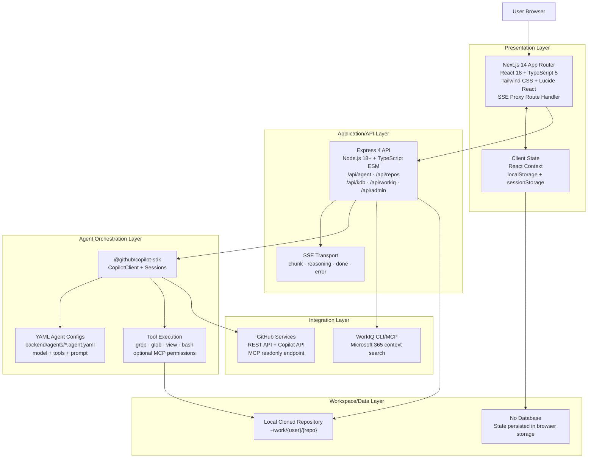
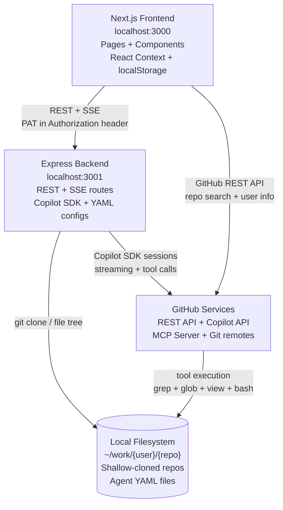
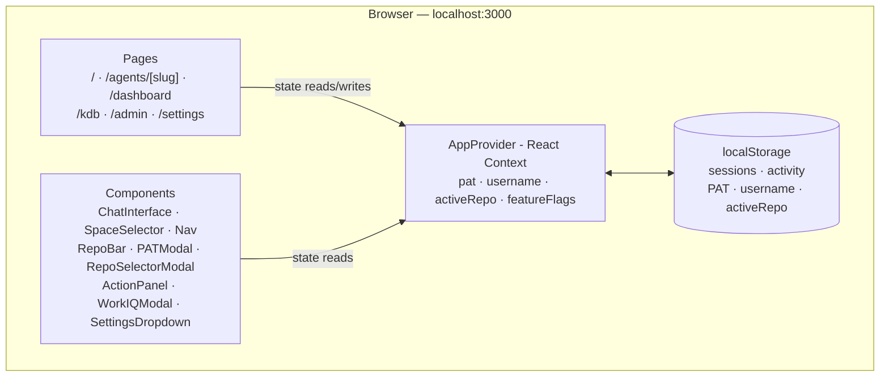
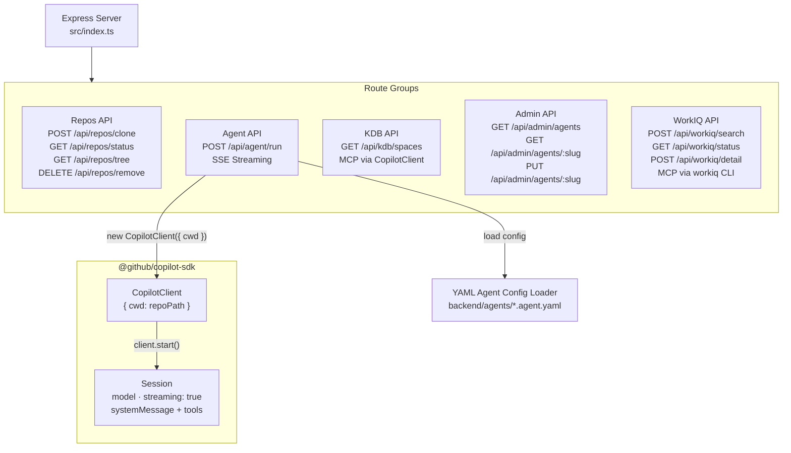
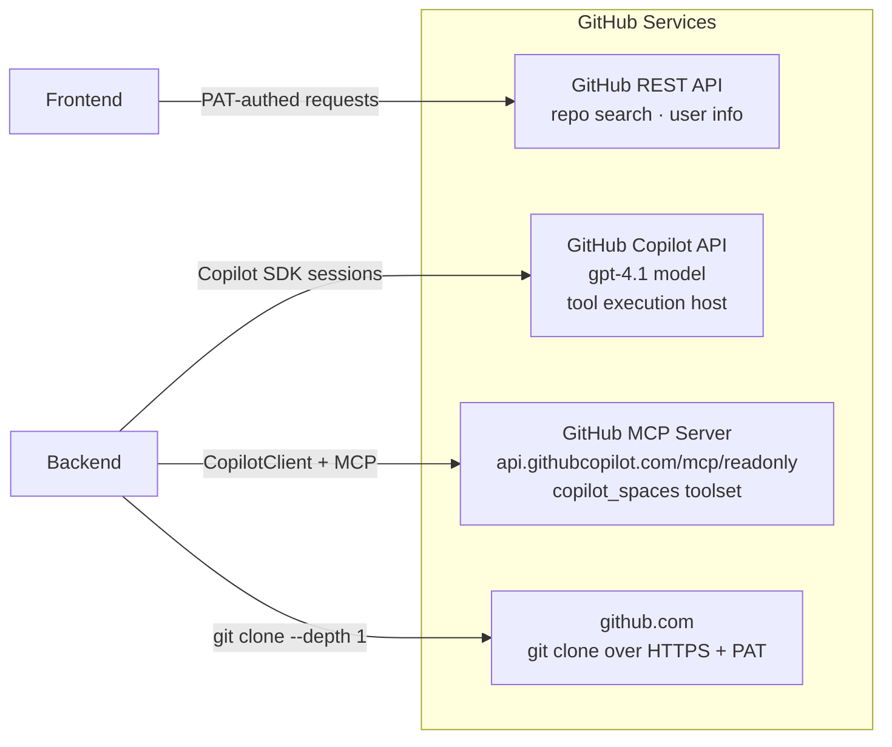
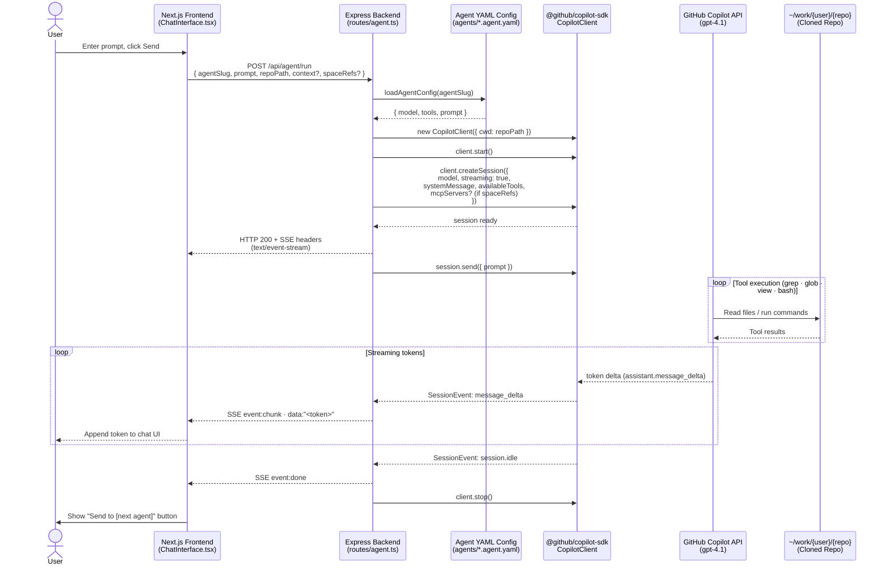
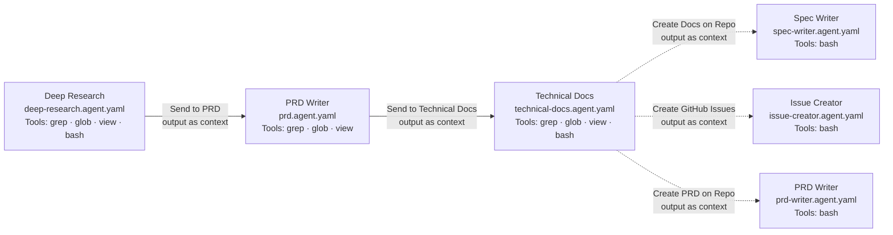

# Architecture

This document describes the system architecture of **Web-Spec** — how the frontend, backend, GitHub Copilot SDK, and external services interact.

---

## System Overview

The system has three layers: a **browser-based frontend**, a **stateless backend**, and **GitHub's cloud services**. The backend bridges the frontend to the Copilot SDK and the local filesystem — it holds no persistent state of its own.

## Layered Architecture (Technology View)

This layered view maps the real technologies used in this repository to each architectural layer.



### Layer Notes

| Layer | Technologies in this project | Main responsibility |
|---|---|---|
| Presentation | Next.js 14, React 18, TypeScript, Tailwind CSS, Lucide React | UI rendering, navigation, user actions, SSE consumption |
| Application/API | Express 4, Node.js 18+, TypeScript ESM | HTTP endpoints, validation, routing, streaming responses |
| Agent Orchestration | `@github/copilot-sdk`, YAML agent configs | Session startup, model/tool config, prompt orchestration |
| Integrations | GitHub REST/Copilot APIs, GitHub MCP, WorkIQ MCP | External data/services and tool-backed context |
| Workspace/Data | Local filesystem (`~/work/...`), browser `localStorage`/`sessionStorage` | Cloned repo workspace and client-side persistence |



### Frontend Internals

The Next.js 14 App Router frontend manages all user-facing state in React Context backed by `localStorage` — no server-side persistence.



### Backend Internals

The Express backend exposes four route groups behind a single server. Agent execution uses the `@github/copilot-sdk` to create streaming sessions against cloned repos.



### External Services

The backend and frontend each communicate with GitHub services directly — the frontend for REST API calls (repo search, user info) and the backend for Copilot SDK sessions, git operations, and MCP-based Copilot Spaces access.



---

## Agent Run — Sequence Diagram

This diagram shows the exact sequence of calls when a user submits a prompt to an agent.



---

## Agent Pipeline

Agents are chained — the output of one session can be forwarded as `context` to the next agent's system prompt.



The three analysis agents (deep-research, prd, technical-docs) use model `o4-mini`. The three action agents (spec-writer, prd-writer, issue-creator) use model `gpt-4.1` and run with `cwd` set to the cloned repository. The action agents are triggered by post-action buttons on the Technical Docs page — they receive the tech-docs output as `context` and use `bash` to create branches/files, PRDs, or GitHub issues via `gh` CLI.

---

## Component Responsibilities

| Layer | Technology | Responsibility |
|-------|-----------|----------------|
| Frontend pages | Next.js 14 App Router | Routing, SSE consumption, UI rendering |
| Frontend state | React Context + localStorage | PAT, username, active repo, sessions, activity log |
| Admin page | `/admin` client component | View/edit agent YAML configs (displayName, description, model, tools, prompt) via REST API |
| Action panel | `ActionPanel` modal component | Stream action agent output (spec-writer, issue-creator) in a modal overlay |
| Backend server | Express 4 + TypeScript | HTTP routing, CORS, request validation |
| Admin API | `routes/admin.ts` | GET/PUT endpoints for reading and writing agent YAML files on disk |
| Repo management | `child_process.execSync` + `git` | Shallow clone, file tree, removal |
| Agent execution | `@github/copilot-sdk` `CopilotClient` | Session lifecycle, prompt dispatch, tool delegation, MCP server integration |
| SSE proxy | Next.js Route Handler (`app/api/agent/run/route.ts`) | Bypasses rewrite-proxy buffering; pipes backend `ReadableStream` directly to client |
| Streaming transport | Server-Sent Events (SSE) | Token-by-token delivery from Copilot API to browser |
| Agent config | YAML files (`agents/*.agent.yaml`) + shared `agentFileMap.ts` | Model, tools, system prompt per agent |
| Model backend | GitHub Copilot API (gpt-4.1) | LLM inference + tool call execution against the repo |
| Feature flags | `/settings` page + `storage.ts` | Toggle visibility of KDB, WorkIQ, and action buttons; persisted in `localStorage` |
| Quick prompts | Agent chat page | One-click prompt buttons on PRD and Technical Docs agents for context-based auto-fill |
| Settings dropdown | `SettingsDropdown` component | Menu with PAT settings, Admin link, and Feature Flags link |
| WorkIQ client | `workiq-client.ts` | Singleton MCP client managing `workiq mcp` stdio subprocess for M365 data search |
| WorkIQ routes | `routes/workiq.ts` | Search, detail, and status endpoints proxying to WorkIQ MCP |
| Repo caching | `repo-cache.ts` + `spaces-cache.ts` | Client-side caching for repository data and Copilot Spaces (5-min TTL) |

---

## Data Flow Summary

1. **User** enters a GitHub PAT and selects a repository in the frontend.
2. **Frontend** calls `POST /api/repos/clone` → backend runs `git clone --depth 1` into `~/work/{username}/{repo}`.
3. **User** picks an agent and submits a prompt.
4. **Frontend** opens an SSE connection via `POST /api/agent/run`.
5. **Backend** reads the agent's YAML config, instantiates a `CopilotClient` with `cwd` pointing to the cloned repo, and creates a streaming session.
6. **GitHub Copilot API** receives the system prompt + user message, executes tool calls (`grep`, `glob`, `view`, `bash`) directly against the repo filesystem, and streams tokens back.
7. **Backend** forwards each `message_delta` event as an SSE `chunk` event.
8. **Frontend** renders tokens in real time. On completion, a "Send to [next agent]" button appears, passing the full response as `context` to the next agent in the chain.
9. **Action agents** — From the Technical Docs page, users can trigger action agents (Spec Writer, PRD Writer, Issue Creator) via post-action buttons. These stream through the same SSE pipeline but execute write operations (git branches, file creation, PRs, GitHub issues) against the repository.

---

## Copilot Spaces via MCP

The Knowledge Base page lists the user's Copilot Spaces by creating a short-lived `CopilotClient` session configured with the GitHub MCP server (`https://api.githubcopilot.com/mcp/readonly`) and the `copilot_spaces` toolset (via the `X-MCP-Toolsets` header). The environment variables `COPILOT_MCP_COPILOT_SPACES_ENABLED=true` and `GITHUB_PERSONAL_ACCESS_TOKEN` must be set on the CopilotClient's env to enable the built-in MCP space tools (`github-list_copilot_spaces`, `github-get_copilot_space`). This takes 10-30 seconds due to the LLM round-trip.

Users can select one or more Copilot Spaces directly from the chat input area using the `SpaceSelector` component. The selected space references (`owner/name` strings) are passed as `spaceRefs: string[]` in `POST /api/agent/run` requests. The backend conditionally attaches the `copilot_spaces` MCP server to the agent session and appends a system prompt instruction listing all selected spaces, instructing the agent to call `get_copilot_space` for each one. The legacy single `spaceRef` parameter is still accepted for backward compatibility and normalized into the array internally.

MCP permission requests (`kind: "mcp"`) are auto-approved in both the KDB listing and agent sessions. Non-MCP permission requests are denied by rules.

---

## WorkIQ Context Integration (Microsoft 365)

Users can search their Microsoft 365 data (emails, meetings, documents, Teams messages, people) from any agent chat page and attach results as hidden context.

### Architecture

```
Frontend (ChatInterface)                   Backend
┌──────────────────────┐          ┌──────────────────────────┐
│ WorkIQ button         │          │ GET  /api/workiq/status   │
│ WorkIQModal (search)  │────────> │ POST /api/workiq/search   │
│                       │          │ POST /api/workiq/detail   │
│ WorkIQContextChips    │          │         │                  │
│     ↓ onSend          │          │    workiq-client.ts        │
│ workiqContext field    │────────> │    (MCP stdio singleton)   │
│  in /api/agent/run    │          │         │                  │
└──────────────────────┘          │   workiq mcp (CLI)         │
                                  └──────────────────────────┘
```

- **Backend**: `workiq-client.ts` manages a singleton MCP client that spawns `workiq mcp` via stdio transport. The `workiqRouter` (`routes/workiq.ts`) exposes `POST /search` and `GET /status` endpoints. The MCP process is lazy-started on first request and auto-restarts on crash.
- **Frontend**: `WorkIQModal` provides search with 400ms debounce. `WorkIQContextChips` renders attached items as removable pills above the textarea. `lib/workiq.ts` caches availability status for 5 minutes.
- **Context forwarding**: Selected items are passed as `workiqContext` in the `/api/agent/run` request body. The backend appends them to the system prompt as a labeled block after handoff context and before space instructions. Total WorkIQ context is capped at ~4000 characters.
- **Graceful degradation**: If `workiq` CLI is not installed, the status endpoint returns `{ available: false }` and the frontend hides the button entirely.
